= TDD : Test Driven Development
:doctype: book
:encoding: utf-8
:lang: fr
:icons: font
:tip-caption: pass:[&#x1F441;]
:warning-caption: pass:[&#9888]
:important-caption: pass:[&#9763;]
:note-caption: pass:[&#33;]
:caution-caption: pass:[&#9761;]
:source-highlighter: rouge
:rouge-style: github
:includedir: _includes
:author: Stéphane BETTON
:email: stéphane.betton@ag2rlamondiale.fr
:toc: left
:toclevels: 6

== Définition
Le TDD est une pratique de développement logiciel qui consiste à écrire les tests unitaires avant d'écrire le code source d'une fonctionnalité. Le but de cette pratique est de garantir que le code source est testable et de s'assurer que les tests soient complets et passent tous avant de passer à l'écriture d'une nouvelle fonctionnalité.

=== Le processus TDD

Il se déroule en trois étapes

* 1ʳᵉ étape : Écrire un test unitaire qui échoue. Le test unitaire doit spécifier le comportement attendu d'une fonction ou d'une méthode.
* 2ᵉ étape : Rédiger le code source pour que le test réussisse. Le code source doit être écrit de manière à satisfaire les exigences du test unitaire.
* 3ᵉ étape : Répéter les étapes 1 et 2 jusqu'à ce que tous les tests unitaires réussissent.

=== Les 3 lois du TDD
* 1ʳᵉ loi : Vous ne pouvez écrire du code que pour faire passer un test unitaire qui échoue.
* 2ᵉ loi : Vous ne pouvez pas écrire plus de code de test unitaire que nécessaire pour faire échouer un test unitaire.
* 3ᵉ loi : Vous ne pouvez pas écrire plus de code que nécessaire pour faire passer le test unitaire échouant.

=== Les 3 qualités du TDD
* 1ʳᵉ qualité : Le code est testable
* 2ᵉ qualité : Le code est testé
* 3ᵉ qualité : Le code est simple

=== Les 3 erreurs du TDD

* 1ʳᵉ erreur : Ecrire du code sans avoir un test unitaire qui échoue
* 2ᵉ erreur : Ecrire plus de code de test unitaire que nécessaire pour faire échouer un test unitaire
* 3ᵉ erreur : Ecrire plus de code que nécessaire pour faire passer le test unitaire échouant

== Concretisation du TDD

Exemple de la salle de sport(musculation) qui vend des abonnements.
Les règles sont les suivantes :

* L'accès à la salle de sport est interdit aux moins 16 ans
* Les tarifs sont dégressifs en fonction de l'âge pour une année d'abonnement.
     - 16-17 ans : 200€/an
     - 18-25 ans : 400€/an
     - 26-64 ans : 600€/an
     - 65 ans et plus : 200€/an

=== L'accès à la salle de sport est interdit aux moins 16 ans

==== 1ʳᵉ étape : Écrire un test unitaire qui échoue
[source,java]
----
package org.hussard.tdd.data;

import org.junit.jupiter.api.DisplayName;
import org.junit.jupiter.api.Test;

import java.time.LocalDate;

import static org.assertj.core.api.Assertions.assertThat;
import static org.assertj.core.api.AssertionsForClassTypes.catchThrowable;

class AdherentBuilderTest {
    @Test
    @DisplayName("L'accès à la salle de sport est interdit aux moins 16 ans")
    void build_Quand_AdherentEstMineur_Attend_UneErreur() {
        LocalDate mineur = LocalDate.now().minusYears(15);
        Throwable thrown = catchThrowable(() -> AdherentBuilder
                .get()
                .dateNaiss(mineur)
                .build());
        assertThat(thrown)
                .isInstanceOf(AdherentMineurException.class)
                .hasMessage("L'accès à la salle de sport est interdit aux moins 16 ans");
    }
}
----
[IMPORTANT]
====
Pour l'instant, il n'existe pas de code or mis celui du test unitaire. Le test unitaire ne compile pas car, les classes Adherent, AdherentBuilder AdherentMineurException n'existent pas
====

.Vue dans l'IDE
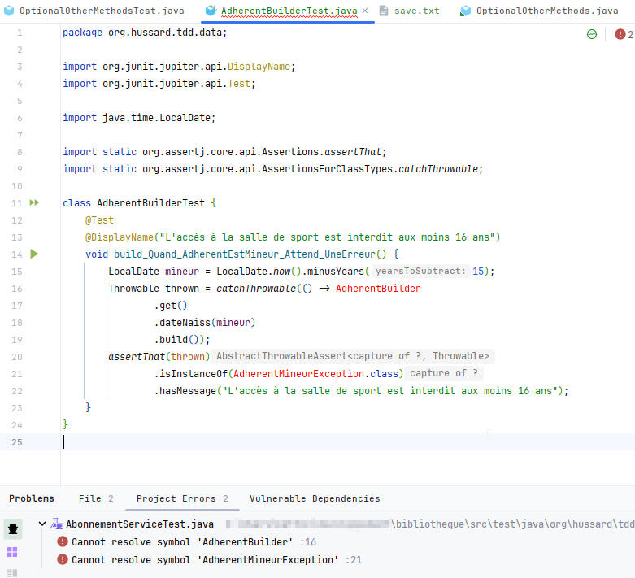

==== 2ᵉ étape : Rédiger le code source pour compiler

[NOTE]
====
Sous l'IDE, il est possible de générer le code source des classes Adherent, AdherentBuilder et de l'exception AdherentMineurException avec les raccourcis clavier suivants en se positionnant sur les noms de classes :
* AdherentBuilder : Alt + Entrée
* AdherentMineurException : Alt + Entrée

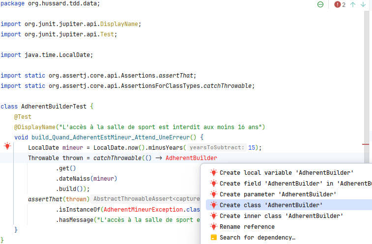
====
Voici le code écrit pour lancer le test unitaire

[source,java]
----
package org.hussard.tdd.data;

public class AdherentBuilder{
    private AdherentBuilder() {
        throw new UnsupportedOperationException("AdherentBuilder is a utility class and cannot be instantiated");
    }
    public static AdherentStep get() {
        return new AdherentApi();
    }
}
----
[source,java]
----
package org.hussard.tdd.data;

public class AdherentMineurException extends RuntimeException {
    public AdherentMineurException() {
        super("L'accès à la salle de sport est interdit aux moins 16 ans");
    }
}
----
[source,java]
----
package org.hussard.tdd.data;

import java.time.LocalDate;

public interface AdherentStep {
    Builder dateNaiss(LocalDate dateNaiss);
    interface Builder {
        Adherent build();
    }
}
----
[source,java]
----
package org.hussard.tdd.data;

import java.time.LocalDate;

public class AdherentApi  implements  AdherentStep, AdherentStep.Builder{
    private LocalDate dateNaiss;
    @Override
    public AdherentStep.Builder dateNaiss(LocalDate dateNaiss) {
        this.dateNaiss = dateNaiss;
        return this;
    }

    @Override
    public Adherent build() {
        return new Adherent("nom", "prenom", this.dateNaiss, "email", "telephone");
    }
}
----
[source,java]
----
package org.hussard.tdd.data;

import java.time.LocalDate;

public class Adherent {
    private final String nom;
    private final String prenom;
    private final LocalDate dateNaiss;
    private final String email;
    private final String telephone;

    Adherent(String nom,
                    String prenom,
                    LocalDate dateNaiss,
                    String email,
                    String telephone) {
        this.nom = nom;
        this.prenom = prenom;
        this.dateNaiss = dateNaiss;
        this.email = email;
        this.telephone = telephone;
    }

    public String getNom() {
        return nom;
    }

    public String getPrenom() {
        return prenom;
    }

    public LocalDate getDateNaiss() {
        return dateNaiss;
    }

    public String getEmail() {
        return email;
    }

    public String getTelephone() {
        return telephone;
    }
}
----

[IMPORTANT]
====
Le code écrit est le minimum pour compiler
====
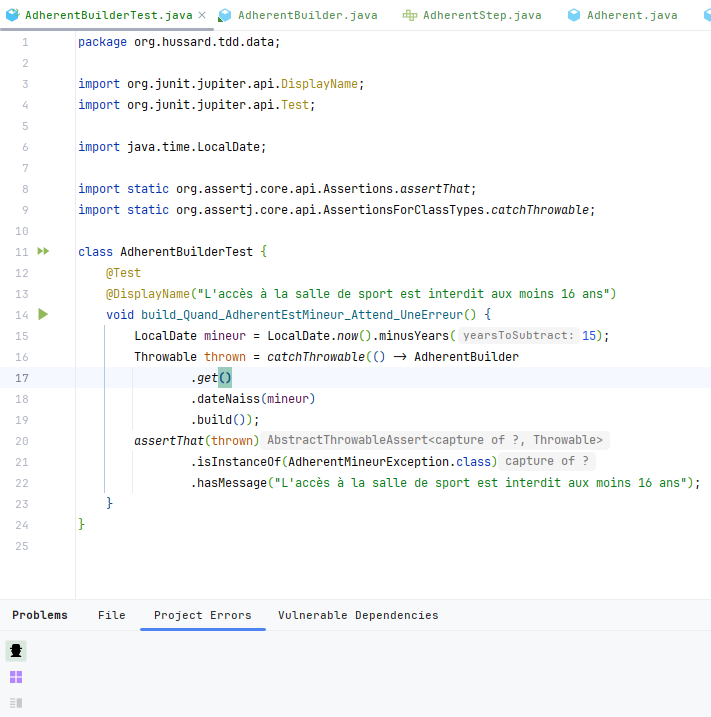

==== 3ᵉ étape : Exécuter le test unitaire
Le test unitaire échoue car, l'exception AdherentMineurException n'est pas levée.

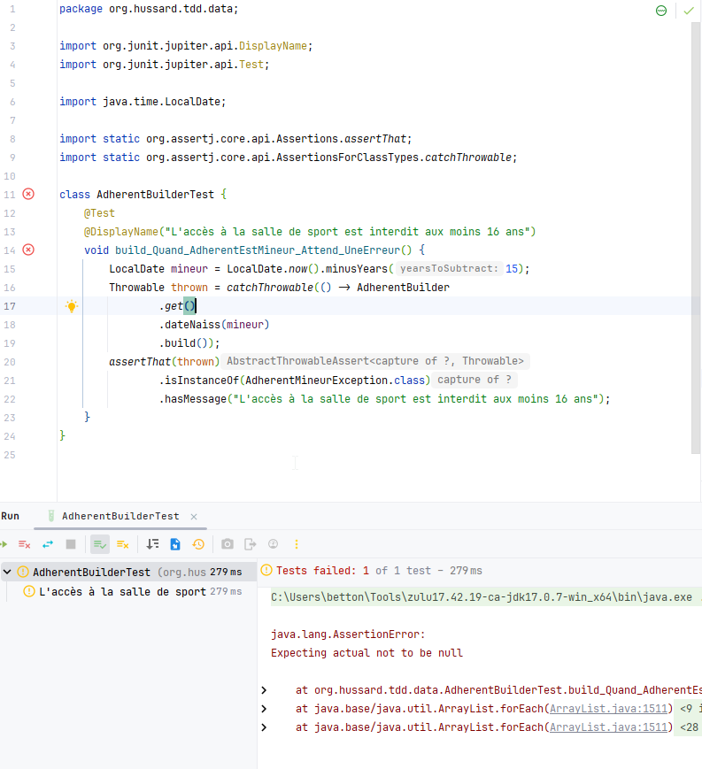

==== 4ᵉ étape : Rédiger le code source pour faire passer le test unitaire

Maintenant, nous allons écrire le code pour faire passer le test unitaire. Et bien sûr, nous allons écrire le minimum de code pour faire passer le test unitaire.
Pour ce faire, nous allons modifier la classe AdherentApi pour lever l'exception AdherentMineurException si l'adhérent est mineur.

[source,java]
----
public class AdherentApi  implements  AdherentStep, AdherentStep.Builder{
    private LocalDate dateNaiss;
   //...

    @Override
    public Adherent build() {
        //Ajout du code pour lever l'exception AdherentMineurException si l'adhérent est mineur
        if(this.dateNaiss.isAfter(LocalDate.now().minusYears(16)))
            throw new AdherentMineurException();
        return new Adherent("nom", "prenom", this.dateNaiss, "email", "telephone");
    }
}
----

On peut remarquer que le test unitaire passe.

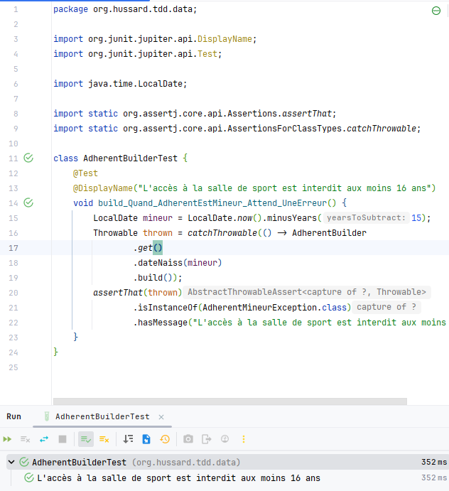

Maintenant, nous allons écrire un nouveau test unitaire pour tester les tarifs dégressifs en fonction de l'âge pour une année d'abonnement.
Pour cela, il suffit de reprendre à l'étape 1. pour le test unitaire suivant.

=== Les tarifs sont dégressifs en fonction de l'âge pour une année d'abonnement

==== 1ʳᵉ étape : Écrire des tests unitaires qui échouent

[NOTE]
====
Les tarifs sont dégressifs en fonction de l'âge pour une année d'abonnement.

- 16-17 ans : 200€/an
- 18-25 ans : 400€/an
- 26-64 ans : 600€/an
- 65 ans et plus : 200€/an
====
[source,java]
----
package org.hussard.tdd.services;

import org.hussard.tdd.data.Adherent;
import org.hussard.tdd.data.AdherentBuilder;
import org.junit.jupiter.api.DisplayName;
import org.junit.jupiter.api.Test;

import java.time.LocalDate;

import static org.assertj.core.api.Assertions.assertThat;

@DisplayName("Les tarifs sont dégressifs en fonction de l âge pour une année d abonnement.")
class AbonnementServiceTest {
    @Test
    @DisplayName("16-17 ans : 200€/an")
    void calculerTarif_Quand_AdherentEstEntre16Et17Ans_Attend_200() {

        LocalDate mineur = LocalDate.now().minusYears(16);
        Adherent adherent = AdherentBuilder
                .get()
                .dateNaiss(mineur)
                .build();
        AbonnementService abonnementService = new AbonnementServiceDefault();
        int tarif = abonnementService.calculerTarif(adherent);
        assertThat(tarif)
                .isEqualTo(200);
    }
    @Test
    @DisplayName("18-25 ans : 400€/an")
    void calculerTarif_Quand_AdherentEstEntre18Et25Ans_Attend_400() {
        LocalDate mineur = LocalDate.now().minusYears(18);
        Adherent adherent = AdherentBuilder
                .get()
                .dateNaiss(mineur)
                .build();
        AbonnementService abonnementService = new AbonnementServiceDefault();
        int tarif = abonnementService.calculerTarif(adherent);
        assertThat(tarif)
                .isEqualTo(400);
    }
    @Test
    @DisplayName("26-64 ans : 600€/an")
    void calculerTarif_Quand_AdherentEstEntre26Et64Ans_Attend_600() {
        LocalDate mineur = LocalDate.now().minusYears(26);
        Adherent adherent = AdherentBuilder
                .get()
                .dateNaiss(mineur)
                .build();
        AbonnementService abonnementService = new AbonnementServiceDefault();
        int tarif = abonnementService.calculerTarif(adherent);
        assertThat(tarif)
                .isEqualTo(600);
    }
    @Test
    @DisplayName("65 ans et plus : 200€/an")
    void calculerTarif_Quand_AdherentEstApret65Ans_Attend_200() {
        LocalDate mineur = LocalDate.now().minusYears(65);
        Adherent adherent = AdherentBuilder
                .get()
                .dateNaiss(mineur)
                .build();
        AbonnementService abonnementService = new AbonnementServiceDefault();
        int tarif = abonnementService.calculerTarif(adherent);
        assertThat( tarif)
                .isEqualTo(200);
    }
}
----
[IMPORTANT]
====
Pour l'instant, il n'existe pas de code or mis celui du test unitaire. Le test unitaire ne compile pas car, Les classes AbonnementService, AbonnementServiceDefault n'existent pas et la méthode calculerTarif n'existe pas.
====
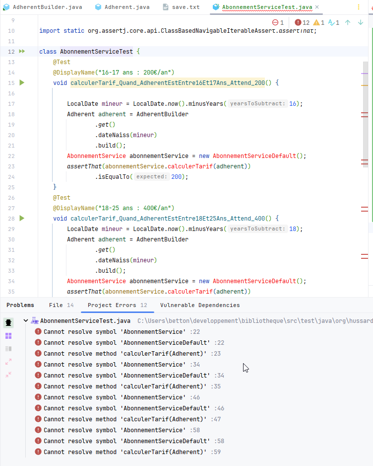

==== 2ᵉ étape : Rédiger le code source pour compiler
[source,java]
----
package org.hussard.tdd.services;

import org.hussard.tdd.data.Adherent;
public interface AbonnementService {
    int calculerTarif(Adherent adherent);
}
----
[source,java]
----
package org.hussard.tdd.services;

import org.hussard.tdd.data.Adherent;
public class AbonnementServiceDefault implements AbonnementService {
    @Override
    public int calculerTarif(Adherent adherent) {
        return 0;
    }
}
----
[IMPORTANT]
====
Le code écrit est le minimum pour compiler et lancer les tests unitaires
====

==== 3ᵉ étape : Exécuter les tests unitaires
Tous les tests unitaires échouent car, la méthode calculerTarif retourne 0.

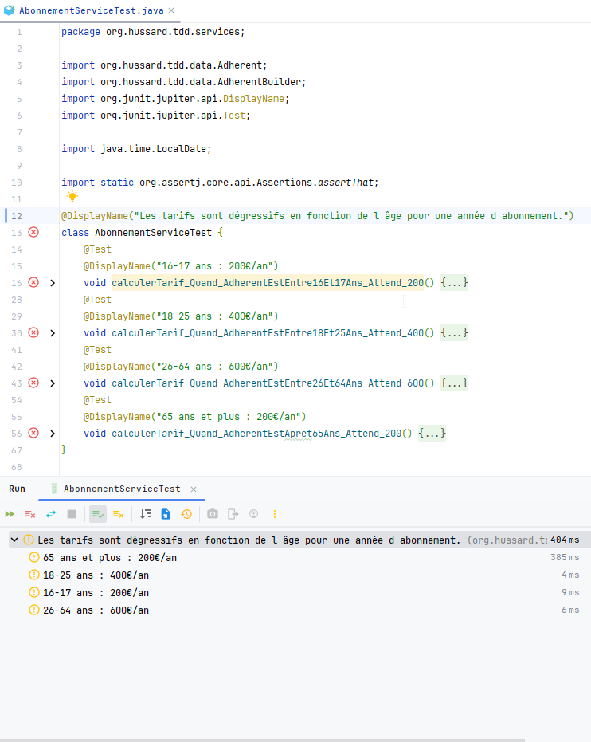

=== 4ᵉ étape : Rédiger le code source pour faire passer les tests unitaires

Maintenant, nous allons écrire le code pour faire passer les tests unitaires. Et bien sûr, nous allons écrire le minimum de code pour faire passer les tests unitaires.

[source,java]
----
package org.hussard.tdd.services;

import org.hussard.tdd.data.Adherent;

public class AbonnementServiceDefault implements AbonnementService {
    @Override
    public int calculerTarif(Adherent adherent) {
        return 200; //Le minimum de code pour faire un test
    }
}
----
[NOTE]
====
On peut remarquer que deux tests unitaires passent.
====
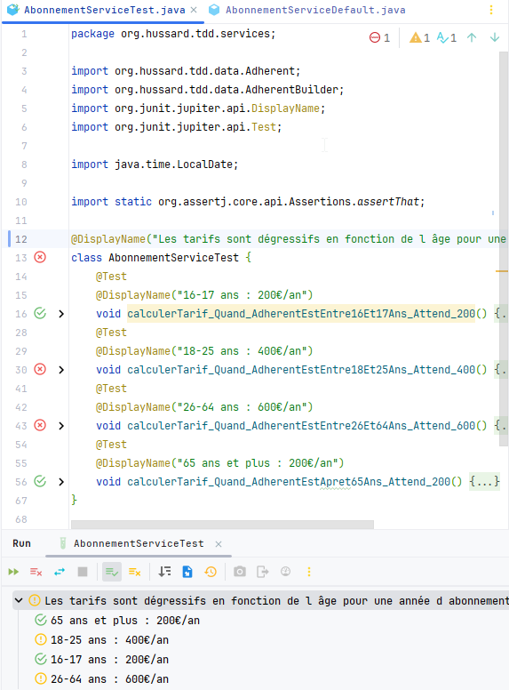

=== 5ᵉ étape : Rédiger le code source pour faire passer un autre test unitaire

Toujours écrire le minimum de code pour faire passer le test unitaire.

.18-25 ans : 400€/an
[source,java]
----
package org.hussard.tdd.services;

import org.hussard.tdd.data.Adherent;

public class AbonnementServiceDefault implements AbonnementService {
    @Override
    public int calculerTarif(Adherent adherent) {
        int age = adherent.getDateNaiss().until(LocalDate.now()).getYears();
        if(age >= 18 && age <= 25)
            return 400;
        return 200;
    }
}
----

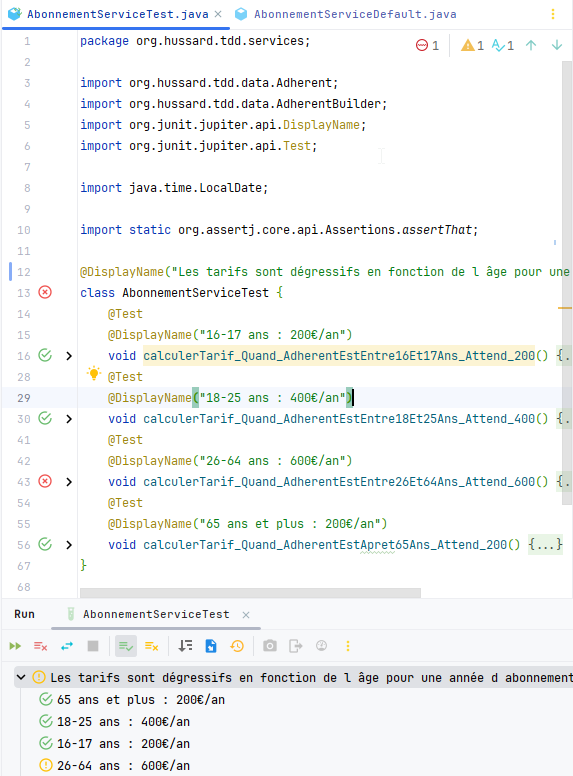

.26-64 ans : 600€/an
[source,java]
----
package org.hussard.tdd.services;

import org.hussard.tdd.data.Adherent;

public class AbonnementServiceDefault implements AbonnementService {
    @Override
    public int calculerTarif(Adherent adherent) {
        int age = adherent.getDateNaiss().until(LocalDate.now()).getYears();
        if(age >= 26 && age <= 64)
            return 600;
        if(age >= 18 && age <= 25)
            return 400;
        return 200;
    }
}
----

[IMPORTANT]
====
On peut remarquer que tous les tests unitaires passent. Ce qui veut dire que le code écrit est suffisant.
====

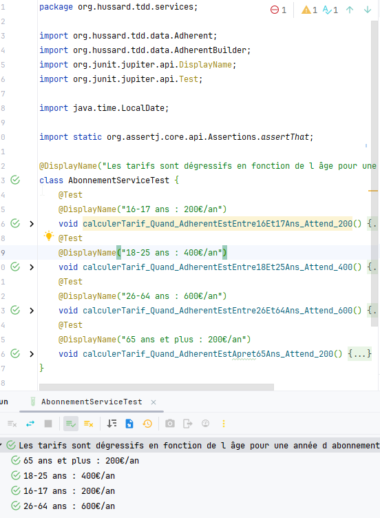

=== Dernière étape : Refactoring

Le code écrit est fonctionnel mais, il n'est pas forcément propre. +
Il faut le refactorer mais il est aussi possible de ne pas avoir besoin de réfactorer.

[source,java]
----
package org.hussard.tdd.services;

import org.hussard.tdd.data.Adherent;

import java.time.LocalDate;

public class AbonnementServiceDefault implements AbonnementService {
    @Override
    public int calculerTarif(Adherent adherent) {
        int age = adherent.getDateNaiss().until(LocalDate.now()).getYears();
        if(age >= 26 && age <= 64)
            return 600;
        if(age >= 18 && age <= 25)
            return 400;
        return 200;
    }
}
----

Personnellement, je ferais juste un petit refactoring/clean code pour

* Extraire la méthode calculerAge
* Extraire les constantes pour les tarifs
* Les tests des if

Cela va ajouter des méthodes et des constantes mais, le code sera plus lisible.

[source,java]
----
package org.hussard.tdd.services;

import org.hussard.tdd.data.Adherent;

import java.time.LocalDate;

public class AbonnementServiceDefault implements AbonnementService {
    private static final int TARIF_16_17_SUP_65 = 200;
    private static final int TARIF_18_25 = 400;
    private static final int TARIF_26_64 = 600;
    @Override
    public int calculerTarif(Adherent adherent) {
        int age = calculerAge(adherent);

        if(isAdulte(age))
            return TARIF_26_64;
        if(isEtudiant(age))
            return TARIF_18_25;

        return TARIF_16_17_SUP_65;
    }

    /**
     * Calculer l'age d'un adhérent
     * @param adherent l'adhérent
     * @return l'âge
     */
    private int calculerAge(Adherent adherent) {
        return adherent.getDateNaiss().until(LocalDate.now()).getYears();
    }

    /**
     * Verifier si l'adhérent est un étudiant avec un âge entre 18 et 25 ans
     * @param age l'age de l'adhérent
     * @return true si l'adhérent est un étudiant
     */
    private boolean isEtudiant(int age) {
        return age >= 18 && age <= 25;
    }

    /**
     * Verifier si l'adhérent est un adulte avec un âge entre 26 et 64 ans
     * @param age l'age de l'adhérent
     * @return true si l'adhérent est un adulte
     */
    private boolean isAdulte(int age) {
        return age >= 26 && age <= 64;
    }
}
----

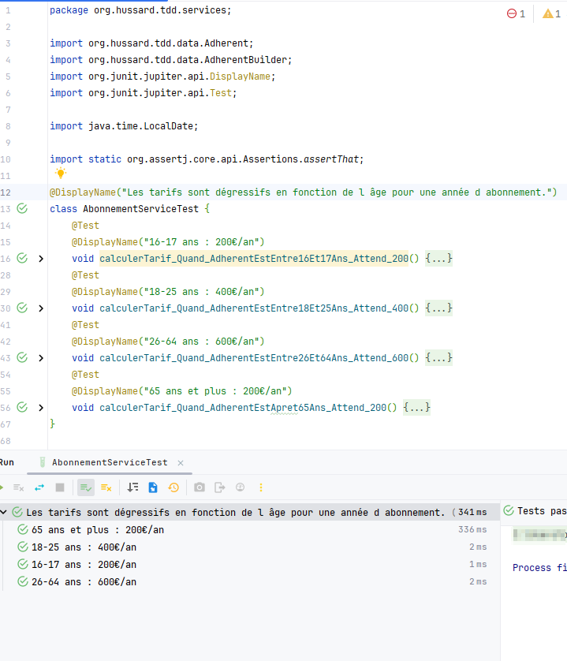

[IMPORTANT]
====
Après chaque refactoring, il faut relancer les tests unitaires pour vérifier que le code fonctionne toujours.
C'est le principe du baby step. Ce qui veut dire qu'après chaque refactoring, il faut relancer les tests unitaires.
Si le code ne fonctionne plus, il faut revenir en arrière(ctr-z).
====

== En Bonus

Il est aussi possible de faire du refactoring sur le code des tests unitaires.

[source,java]
----
package org.hussard.tdd.services;

import org.hussard.tdd.data.Adherent;
import org.hussard.tdd.data.AdherentBuilder;
import org.junit.jupiter.api.DisplayName;
import org.junit.jupiter.params.ParameterizedTest;
import org.junit.jupiter.params.provider.Arguments;
import org.junit.jupiter.params.provider.MethodSource;

import java.time.LocalDate;
import java.util.stream.Stream;

import static org.assertj.core.api.Assertions.assertThat;

@DisplayName("Les tarifs sont dégressifs en fonction de l âge pour une année d abonnement.")
class AbonnementServiceTest {
    private final AbonnementService abonnementService = new AbonnementServiceDefault();

    @ParameterizedTest(name = "Adherent de {0} ans : {1}€/an")
    @MethodSource("reglesTarifs")
    void calculerTarif(int annee,
                       int tarif) {
        LocalDate dateNaissance = LocalDate.now().minusYears(annee);
        Adherent adherent = AdherentBuilder
                .get()
                .dateNaiss(dateNaissance)
                .build();

        int tarifColcule = abonnementService.calculerTarif(adherent);
        assertThat(tarifColcule)
                .isEqualTo(tarif);
    }

    private static Stream<Arguments> reglesTarifs() {
        return Stream.of(
                Arguments.of(16, 200),
                Arguments.of(18, 400),
                Arguments.of(26, 600),
                Arguments.of(65, 200)
        );
    }
}

----
