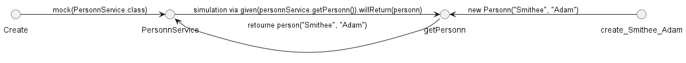

= Test Unitaire Mock
:doctype: book
:encoding: utf-8
:lang: fr
:icons: font
:tip-caption: pass:[&#x1F441;]
:warning-caption: pass:[&#9888]
:important-caption: pass:[&#9763;]
:note-caption: pass:[&#33;]
:caution-caption: pass:[&#9761;]
:source-highlighter: rouge
:rouge-style: github
:includedir: _includes
:author: Stéphane BETTON
:email: stéphane.betton@ag2rlamondiale.fr
:toc: left
:toclevels: 6

== Premier pas
Nous allons voir comment utiliser un mock pour tester une methode d'une class.
La classe `PersonnService` a une methode `getPersonn` qui retourne un objet de type `Personn`.

=== Définition des classes
// creation d'un class personn avec les attributs nom et prenom
[source,java]
----
package org.hussard.testunitaire.mock.premierpas;

public class Personn {
    private final String nom;
    private final String prenom;
    public Personn(String nom, String prenom) {
        this.nom = nom;
        this.prenom = prenom;
    }
    public String getNom() {
        return nom;
    }
    public String getPrenom() {
        return prenom;
    }
}
----

// creation d'un class PersonnService avec une methode qui retourne un objet de type Personn
[source,java]
----
package org.hussard.testunitaire.mock.premierpas;

public class PersonnService {
    public Personn getPersonn() {
        return new Personn("Doe", "John");
    }
}
----
=== Test Unitaire
==== Test simple sans mock
Le test suivant va tester la methode getPersonn de la class PersonnService sans avoir recours à un mock.

// creation d'un class PersonnServiceTest qui test la methode getPersonn de la class PersonnService
[source,java]
----
package org.hussard.testunitaire.mock.premierpas;

import org.junit.jupiter.api.Test;

import static org.assertj.core.api.Assertions.assertThat;

class PersonnServiceTest {
    @Test
    void getPersonn() {
        //declaration du service à tester
        PersonnService personnService = new PersonnService();
        // appel de la méthode à tester
        Personn resultat = personnService.getPersonn();
        // on vérifie que le résultat est bien celui attendu
        assertThat(resultat.getNom()).isEqualTo("Doe");
        assertThat(resultat.getPrenom()).isEqualTo("John");
    }
}
----
.Diagramme d'enchainement
image::../asciidoc/images/TestUnitaireMock_sequence_premierpas_1.png[]

==== Test avec mock
Le test suivant va tester la methode getPersonn de la class PersonnService avec un mock.
C'est-à-dire que nous allons simuler le comportement de la methode getPersonn de la class PersonnService.

// creation d'un class PersonnServiceMockTest qui test la methode getPersonn de la class PersonnService avec un mock
[source,java]
----
package org.hussard.testunitaire.mock.premierpas;

import org.junit.jupiter.api.Test;

import static org.assertj.core.api.Assertions.assertThat;
import static org.mockito.BDDMockito.given;
import static org.mockito.Mockito.mock;

class PersonnServiceMockTest {
    @Test
    void getPersonn() {
        //Décclaration du mock, on va simuler le comportement de la classe PersonnService
        PersonnService personnService = mock(PersonnService.class);
        // definition de la valeur de retour de la méthode getPersonn()
        Personn personn = new Personn("Smithee", "Adam");
        // on simule le comportement de la méthode getPersonn()
        given(personnService.getPersonn()).willReturn(personn);
        // on appelle la méthode getPersonn()
        Personn resultat = personnService.getPersonn();
        // on vérifie que le résultat est bien celui attendu
        assertThat(resultat.getNom()).isEqualTo("Smithee");
        assertThat(resultat.getPrenom()).isEqualTo("Adam");
    }
}
----
.Diagramme d'enchainement

== Deuxieme pas
Nous allons traiter le cas d'un service qui va faire appel à une sauvegarde d'une personne en base de données puis envoyer un mail de confirmation.
Au moment du développement, nous n'avons pas encore de base de données et de serveur de mail, nous allons donc simuler la sauvegarde en base de données et l'envoi du mail.

=== Définition des classes
// creation d'un class PersonnService qui va faire appel a une sauvegarde d'une personne en base de données puis envoyer un mail de confirmation
[source,java]
----
package org.hussard.testunitaire.mock.deuxiemepas;

public class Personn {
    private final String nom;
    private final String prenom;
    private final String email;
    public Personn(String nom, String prenom, String email) {
        this.nom = nom;
        this.prenom = prenom;
        this.email = email;
    }
    public String getNom() {
        return nom;
    }
    public String getPrenom() {
        return prenom;
    }
    public String getEmail() {
        return email;
    }
}
----
// creation d'un class PersonnService qui va faire appel a une sauvegarde d'une personne en base de données puis envoyer un mail de confirmation
[source,java]
----
package org.hussard.testunitaire.mock.deuxiemepas;

public class PersonnService{
    private final PersonnDao personnDao;
    private final MailService mailService;

    public PersonnService(PersonnDao personnDao, MailService mailService) {
        this.personnDao = personnDao;
        this.mailService = mailService;
    }
    public boolean savePersonn(Personn personn) {
        boolean isEnregistrer = personnDao.save(personn);
        boolean isMailEnvoyer = mailService.sendMail(personn.getEmail(), "Confirmation", "Votre personne a bien été enregistrée");
        return isEnregistrer && isMailEnvoyer;
    }
}
----
// creation d'un class PersonnDao qui va sauvegarder une personne en base de données

Au moment du développement, nous n'avons pas encore de base de données, nous allons donc simuler la sauvegarde en base de données.

[source,java]
----
package org.hussard.testunitaire.mock.deuxiemepas;

public class PersonnDao {
    public boolean save(Personn personn) {
        // sauvegarde en base de données
        return true;
    }
}
----

// creation d'un class MailService qui va envoyer un mail
Au moment du développement, nous n'avons pas encore de serveur de mail, nous allons donc simuler l'envoi du mail.

[source,java]
----
package org.hussard.testunitaire.mock.deuxiemepas;

public class MailService {
    public boolean sendMail(String email, String subject, String message) {
        // envoi du mail
        return true;
    }
}
----
=== Test Unitaire

==== Test simple sans mock
Le test suivant va tester la methode savePersonn de la class PersonnService sans avoir recours à un mock.

// creation d'un class PersonnServiceTest qui test la methode savePersonn de la class PersonnService
[source,java]
----
public class PersonnServiceTest {
    @Test
    public void testSavePersonn() {
        PersonnDao personnDao = new PersonnDao();
        MailService mailService = new MailService();
        PersonnService personnService = new PersonnService(personnDao, mailService);
        Personn personn = new Personn("DUPONT", "Jean", "jean.dupont@yahoo.fr");
        boolean resulat = personnService.savePersonn(personn);
        assertThat(resulat).isTrue();
    }
}
----
À ce moment-là, nous sommes bien content puisque nous avons un test qui fonctionne.
Mais si nous regardons de plus près, *nous nous rendons compte que nous avons un problème*.
En effet, nous avons un test qui va sauvegarder une personne en base de données et envoyer un mail. [red]#*Mais dans tous les cas, nous aurons un test qui va retourner true*#.

==== Test simple avec mock
Dans l'état des choses, nous ne pouvons pas tester la methode savePersonn de la class PersonnService sans avoir recours à un mock. Pour cela, nous devons modifier la definition de la class PersonnService.

===== Prérequis

Dans l'état des choses, nous ne pouvons pas tester la methode savePersonn de la class PersonnService sans avoir recours à quelques modifications.

====== Modification de la class PersonnService
Nous allons modifier le constructeur de la class PersonnService pour qu'il prenne en paramètre une interface PersonnDao et une interface MailService. Cela ne modifie pas le fonctionnement de la class PersonnService mais cela va nous permettre de pouvoir utiliser un mock.

Nous allons en profiter pour renommer les classes PersonnDao et MailService en PersonnDaoOracle et MailServiceGmail. Et par la même occasion, nous allons créer les interfaces PersonnDao et MailService.

[NOTE]
====
*Pourquoi faire cela ?* +
Il est conseillé de nommer les classes de services avec le nom de la technologie utilisée. Cela permet de savoir rapidement quelles sont les technologies utilisées dans le projet.

Et le nom des interfaces doit être le nom de l'action réalisée par le service.
====

[source,java]
----
package org.hussard.testunitaire.mock.deuxiemepas;
public class PersonnService{
    private final PersonnDao personnDao;
    private final MailService mailService;
    public PersonnService(PersonnDao personnDao, MailService mailService) {
        this.personnDao = personnDao;
        this.mailService = mailService;
    }
    public boolean savePersonn(Personn personn) {
        boolean isEnregistrer = personnDao.save(personn);
        boolean isMailEnvoyer = mailService.sendMail(personn.getEmail(), "Confirmation", "Votre personne a bien été enregistrée");
        return isEnregistrer && isMailEnvoyer;
    }
}
----
====== Renommer les classes PersonnDao et MailService

// renommer la class PersonnDao en PersonnDaoOracle
[source,java]
----
package org.hussard.testunitaire.mock.deuxiemepas;
public class PersonnDaoOracle {
    public boolean save(Personn personn) {
        // sauvegarde en base de données
        return true;
    }
}
----
// renommer la class MailService en MailServiceGmail
[source,java]
----
package org.hussard.testunitaire.mock.deuxiemepas;
public class MailServiceGmail {
    public boolean sendMail(String email, String subject, String message) {
        // envoi du mail
        return true;
    }
}
----
====== Création des interfaces PersonnDao et MailService

// creation d'une interface PersonnDao
[source,java]
----
package org.hussard.testunitaire.mock.deuxiemepas;
public interface PersonnDao {
    boolean save(Personn personn);
}
----
// creation d'une interface MailService
[source,java]
----
package org.hussard.testunitaire.mock.deuxiemepas;
public interface MailService {
    boolean sendMail(String email, String subject, String message);
}
----
====== Implémentation des interfaces PersonnDao et MailService

// creation d'une class PersonnDaoOracle qui implemente l'interface PersonnDao
[source,java]
----
package org.hussard.testunitaire.mock.deuxiemepas;
public class PersonnDaoOracle implements PersonnDao {
    public boolean save(Personn personn) {
        // sauvegarde en base de données
        return true;
    }
}
----

// creation d'une class MailServiceGmail qui implemente l'interface MailService
[source,java]
----
package org.hussard.testunitaire.mock.deuxiemepas;
public class MailServiceGmail implements MailService {
    public boolean sendMail(String email, String subject, String message) {
        // envoi du mail
        return true;
    }
}
----
====== Modification de la class PersonnService
Avec toutes ces modifications, nous pouvons maintenant modifier la class PersonnService pour qu'elle prenne en paramètre une interface PersonnDao et une interface MailService. Mais sans la modifier.

// modification de la class PersonnService pour qu'elle prenne en parametre une interface PersonnDao et une interface MailService
[source,java]
----
package org.hussard.testunitaire.mock.deuxiemepas;
public class PersonnService{
    private final PersonnDao personnDao;
    private final MailService mailService;
    public PersonnService(PersonnDao personnDao, MailService mailService) {
        this.personnDao = personnDao;
        this.mailService = mailService;
    }
    public boolean savePersonn(Personn personn) {
        boolean isEnregistrer = personnDao.save(personn);
        boolean isMailEnvoyer = mailService.sendMail(personn.getEmail(), "Confirmation", "Votre personne a bien été enregistrée");
        return isEnregistrer && isMailEnvoyer;
    }
}
----
====== Modification du test unitaire
Nous pouvons maintenant modifier le test unitaire précédent.

// modification du test unitaire pour qu'il utilise les interfaces PersonnDao et MailService
[source,java]
----
public class PersonnServiceTest {
    @Test
    public void testSavePersonn() {
        PersonnDao personnDao = new PersonnDaoOracle();
        MailService mailService = new MailServiceGmail();
        PersonnService personnService = new PersonnService(personnDao, mailService);
        Personn personn = new Personn("DUPONT", "Jean", "jean.dupont@yahoo.fr");
        boolean resulat = personnService.savePersonn(personn);
        assertThat(resulat).isTrue();
    }
}
----

[IMPORTANT]
====
Le test fonctionne toujours.
====

==== Utilisation d'un mock

Nous allons voir deux façons d'utiliser un mock. Car il y a bien deux méthodes de faire de la simulation (mock). +

* La premiere est d'utiliser la librairie Mockito, il en existe d'autre mais, celle-ci est la plus populaire.
* La deuxième sans avoir recours à une librairie, elle est moins  populaire et pourtant elle est très simple à utiliser et très puissante.

===== Utilisation de la librairie Mockito
Pour utiliser la librairie Mockito, il faut ajouter la dépendance suivante dans le fichier pom.xml.

[source,xml]
----
<dependency>
    <groupId>org.mockito</groupId>
    <artifactId>mockito-core</artifactId>
    <version>2.23.4</version> <!-- version à adapter -->
    <scope>test</scope>
</dependency>
----

// creation d'un class PersonnServiceMockTest qui test la methode savePersonn de la class PersonnService avec un mock
[source,java]
----
public class PersonnServiceMockTest {
    @Test
    public void testSavePersonn() {
        PersonnDao personnDao = mock(PersonnDao.class);
        MailService mailService = mock(MailService.class);
        PersonnService personnService = new PersonnService(personnDao, mailService);
        Personn personn = new Personn("DUPONT", "Jean", "jean.dupont@yahoo.fr");
        when(personnDao.save(personn)).thenReturn(true);
        when(mailService.sendMail(personn.getEmail(), "Confirmation", "Votre personne a bien été enregistrée")).thenReturn(true);
        boolean resulat = personnService.savePersonn(personn);
        assertThat(resulat).isTrue();
    }
}
----
===== Utilisation sans librairie
Pour utiliser sans librairie, il faut créer une class MockPersonnDao et une class MockMailService qui implemente les interfaces PersonnDao et MailService.

// creation d'une class MockPersonnDao qui implemente l'interface PersonnDao
[source,java]
----
package org.hussard.testunitaire.mock.deuxiemepas;
public class MockPersonnDao implements PersonnDao {
    public boolean save(Personn personn) {
        return true;
    }
}
----
// creation d'une class MockMailService qui implemente l'interface MailService
[source,java]
----
package org.hussard.testunitaire.mock.deuxiemepas;
public class MockMailService implements MailService {
    public boolean sendMail(String email, String subject, String message) {
        return true;
    }
}
----
// creation d'un class PersonnServiceMockTest qui test la methode savePersonn de la class PersonnService avec un mock
[source,java]
----
public class PersonnServiceMockTest {
    @Test
    public void testSavePersonn() {
        PersonnDao personnDao = new MockPersonnDao();
        MailService mailService = new MockMailService();
        PersonnService personnService = new PersonnService(personnDao, mailService);
        Personn personn = new Personn("DUPONT", "Jean", "jean.dupont@yahoo.fr");
        boolean resulat = personnService.savePersonn(personn);
        assertThat(resulat).isTrue();
    }
}
----
