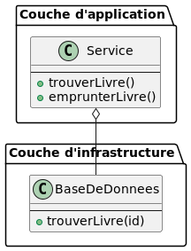

:doctype: book
:encoding: utf-8
:lang: en
:icons: font
:tip-caption: pass:[&#x1F441;]
:warning-caption: pass:[&#9888]
:important-caption: pass:[&#9763;]
:note-caption: pass:[&#33;]
:caution-caption: pass:[&#9761;]
:source-highlighter: rouge
:rouge-style: github
:includedir: _includes
:author: Stéphane BETTON
:email: stéphane.betton@ag2rlamondiale.fr
:toc: left
:toclevels: 6

== Clean architecture

=== Introduction

La **clean architecture** est une approche de l'architecture logicielle qui vise à créer des systèmes logiciels qui sont [.underline]#*`_faciles à comprendre, à maintenir et à évoluer_`*#. Elle est basée sur une série de principes et de pratiques qui permettent de séparer les différents aspects d'un système logiciel, tels que [.underline]#*`_les données, les règles métier et l'interface utilisateur_`*#.

==== Les principes de la clean architecture

La clean architecture repose sur les principes suivants :

* [green]*Indépendance des composants :*

 Les différents composants d'un système logiciel doivent être indépendants les uns des autres. Cela permet de faciliter la maintenance et l'évolution du système.

* [green]*Responsabilité unique :*

 Chaque composant d'un système logiciel doit avoir une responsabilité unique. Cela permet d'améliorer la clarté et la compréhension du système.

* [green]*Inversion des dépendances :*

 Les composants d'un système logiciel ne doivent pas dépendre de détails d'implémentation. Cela permet de faciliter la maintenance et l'évolution du système.

* [green]*Portabilité :*

 Les composants d'un système logiciel doivent être portables. Cela permet de les réutiliser dans d'autres systèmes.

* [green]*Testabilité :*

 Les composants d'un système logiciel doivent être testables. Cela permet de garantir leur qualité.

==== Les pratiques de la clean architecture

La clean architecture est également basée sur une série de pratiques qui permettent de mettre en œuvre les principes ci-dessus. Ces pratiques incluent :

* [green]*L'utilisation de couches :*

 Un système logiciel peut être divisé en différentes couches, chacune ayant une responsabilité unique.

* [green]*L'utilisation d'interfaces :*

 Les composants d'un système logiciel doivent communiquer entre eux via des interfaces. Cela permet de séparer les détails d'implémentation.

* [green]*L'utilisation de tests :*

 Les composants d'un système logiciel doivent être testés. Cela permet de garantir leur qualité.

==== Exemple de clean architecture

Un exemple de clean architecture est la suivante :

* [yellow]*Couche d'interface utilisateur :*

 Cette couche est responsable de l'affichage des données et de la collecte des entrées de l'utilisateur.

* [green]*Couche d'application :*

 Cette couche est responsable de la logique métier du système.

* [red]*Couche d'infrastructure :*

  Cette couche est responsable de la gestion des données et des ressources externes.

Dans cette architecture,
 [red]#les différentes couches sont indépendantes les unes des autres#.

[.listing]
* La couche d'interface utilisateur ne dépend pas de la couche d'application,

[source,java]
----
include::../../main/java/org/hussard/samples/clean/Controleur.java[]
----
[source,java]
----
include::../../main/java/org/hussard/samples/clean/Service.java[]
----
[source,java]
----
include::../../main/java/org/hussard/samples/clean/ServiceDefault.java[]
----

[NOTE]
Dans ce code, le contrôleur ne dépend pas de l'implémentation du service. Il suffit que le service implémente l'interface "Service". Cela permet au contrôleur d'être utilisé avec n'importe quelle implémentation du service, par exemple une implémentation qui utilise une base de données ou une implémentation qui utilise un service Web.

* La couche d'application ne dépend pas de la couche d'infrastructure.

[source,java]
----
include::../../main/java/org/hussard/samples/clean/Service.java[]
----
[source,java]
----
include::../../main/java/org/hussard/samples/clean/BaseDeDonnees.java[]
----
[source,java]
----
include::../../main/java/org/hussard/samples/clean/BaseDeDonneesDefault.java[]
----

[NOTE]
Dans ce code, le service ne dépend pas de l'implémentation de la base de données. Il suffit que la base de données implémente l'interface "BaseDeDonnees". Cela permet au service d'être utilisé avec n'importe quelle implémentation de la base de données, par exemple une implémentation qui utilise une base de données relationnelle ou une implémentation qui utilise une base de données NoSQL.

==== Avantages de la clean architecture

La clean architecture offre de nombreux avantages, notamment :

* [green]*La facilité de compréhension et de maintenance :*

  La clean architecture permet de créer des systèmes logiciels qui sont faciles à comprendre et à maintenir. Cela est dû à la séparation des différents aspects du système.

* [green]*La facilité d'évolution :*

 La clean architecture permet de faire évoluer les systèmes logiciels de manière simple et efficace. Cela est dû à la faible dépendance entre les différents composants.

* [green]*La portabilité :*

 La clean architecture permet de réutiliser les composants d'un système logiciel dans d'autres systèmes. Cela est dû à l'utilisation d'interfaces.

* [green]*La testabilité :*

 La clean architecture permet de tester les composants d'un système logiciel de manière simple et efficace. Cela est dû à l'utilisation d'interfaces et de tests.

==== Les inconveniants de la clean architecture

* [red]*La complexité :* La clean architecture peut être complexe à mettre en œuvre et à maintenir. Cela est dû à la séparation des différents aspects du système.
* [red]*La performance :* La clean architecture peut avoir un impact négatif sur les performances du système. Cela est dû à l'utilisation d'interfaces et à la nécessité de convertir les données entre les différentes couches.
* [red]*La flexibilité :* La clean architecture peut limiter la flexibilité du système. Cela est dû à la séparation des différents aspects du système.

==== Quelques exemples d'inconvénients de la clean architecture

* [red]*La complexité :*

 La clean architecture peut être difficile à comprendre et à maintenir, en particulier pour les développeurs qui ne sont pas familiers avec cette approche.

* [red]*La performance :*

 L'utilisation d'interfaces et la nécessité de convertir les données entre les différentes couches peuvent avoir un impact négatif sur les performances du système.

* [red]*La flexibilité :*

 La séparation des différents aspects du système peut limiter la flexibilité du système, en particulier pour les changements qui nécessitent des modifications dans plusieurs couches.

===== Surmonter les inconvénients de la clean architecture

Il existe plusieurs moyens de surmonter les inconvénients de la clean architecture. Voici quelques conseils :

* [green]*Simplifier la conception :*

 Il est important de simplifier la conception de l'architecture autant que possible. Cela permettra de réduire la complexité et d'améliorer la performance.

* [green]*Utiliser des outils appropriés :*

 Il existe des outils qui peuvent aider à simplifier la mise en œuvre et la maintenance de la clean architecture.

* [green]*Être flexible :*

 Il est important d'être flexible dans l'application de la clean architecture. Il n'est pas nécessaire de respecter aveuglément tous les principes et pratiques.

==== Conclusion

La clean architecture est une approche de l'architecture logicielle qui offre de nombreux avantages. Elle permet de créer des systèmes logiciels qui sont faciles à comprendre, à maintenir et à évoluer. Cependant, il est important d'être conscient des inconvénients potentiels avant de l'adopter.

[NOTE]
* Tout ce qui écrit dans ce document est mon interpretation personnel du sujet
* Il est tout à fait possible de mettre les packages suivants en module maven

=== La composition
Dans cette partie, nous allons voir les éléments importants qui constituent la **clean architecture**

==== La répartition

Elle se compose en 3 parties :

* Une partie application, cette partie est le point d'entrée du backEnd.
* Une partie métier(business), celle-ci contiendra uniquement toutes les règles métiers
* Une partie infrastructure, elle aura pour but de communiquer avec les différents services de l'entreprise, tel-que : une base de données, un service, des fichiers .etc

[IMPORTANT]
Il est interdit d'avoir plus de partie

==== Les règles
Elles vont permettre de bien mettre en place l'utilisation de la solution **clean architecture**

===== Métier
*La plus importante de toutes, il est strictement de faire communiquer un élément du package métier(business) avec les deux autres(application, architecture). Ce qui veut dire par exemple, il n'est pas possible d'avoir des mappers*

===== Application
Cette partie peut communiquer avec les deux autres parties de la façon suivante :

* Implémentera une interface de la partie métier pour utiliser un service de la partie métier
* Implémentera une interface de la partie métier pour utiliser un service de la partie infrastructure

===== Infrastructure
Cette partie implémentera une interface de la partie métier pour créer des services

==== La structure
Nous allons définir les éléments qui seront dans chacune des parties

===== Métier

===== Application

===== Infrastructure

=== ressources
* https://leandeep.com/clean-architecture/[leandeep.com]
* https://www.happycoders.eu/software-craftsmanship/hexagonal-architecture/[software-craftsmanship]
* https://en.wikipedia.org/wiki/Hexagonal_architecture_(software)[wikipedia]
* https://www.thoughtworks.com/insights/blog/architecture/demystify-software-architecture-patterns[demystify-software-architecture-patterns]
* https://www.milanjovanovic.tech/blog/why-clean-architecture-is-great-for-complex-projects[milanjovanovic]

Exemple:

* https://github.com/spring-projects/spring-petclinic/blob/main/readme.md[Todo]
