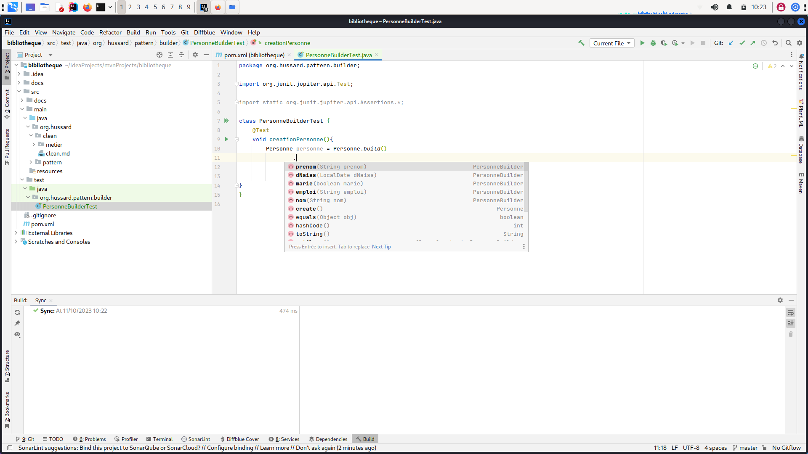
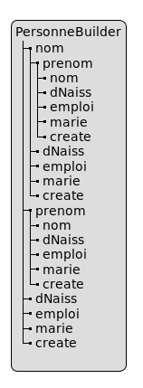
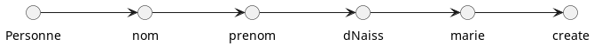
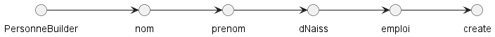
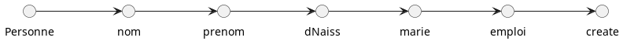
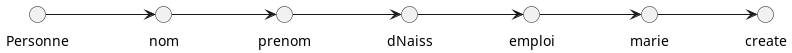
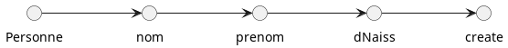

:doctype: book
:encoding: utf-8
:lang: fr
:icons: font
:tip-caption: pass:[&#x1F441;]
:warning-caption: pass:[&#9888]
:important-caption: pass:[&#9763;]
:note-caption: pass:[&#33;]
:caution-caption: pass:[&#9761;]
:source-highlighter: rouge
:rouge-style: github
:includedir: _includes
:author: Stéphane BETTON
:email: stéphane.betton@ag2rlamondiale.fr
:toc: left
:toclevels: 6

== Pattern fluent

=== A propos
Le *pattern fluent* est une solution de *pattern Builder* qui presente un avantage intéressant.

=== Exemples

La classe de notre exemple est la suivante, elle est composée de

* 3 propriétés obligatoires et dans l'ordre suivant : `nom, prenom, dNaiss`
* 2 propriétés optionnelles : `emploi, marie`

[source,java]
----
public class Personne {
    //Les propriétés OBLIGATOIRES
    private final String nom; // premier
    private final String prenom; // deuxième
    private final LocalDate dNaiss; // troisième
    //Les propriétés optionnelles
    private final String emploi;
    private final boolean marie;
}
----
==== Builder
===== Source
Voici un exemple du pattern builder :
[source,java]
----
include::../../main/java/org/hussard/pattern/builder/Personne.java[]
----

===== Test unitaire
Le test unitaire associé
[source,java]
----
include::../../test/java/org/hussard/pattern/builder/PersonneTest.java[]
----

==== Constat

[IMPORTANT]
====
On peut remarque que si dans le premier test, le développeur a bien renseigné toutes les propriétés. +
Par-contre, dans le deuxième test, il n'a renseigné que le `nom` alors qu'il y a encore deux propriétés **obligatoires** (`prenom, dNaiss`). +
Sans parler du dernier test....
====

On peut facilement le voir avec l'aide à la saisie des IDE, l'image ci-dessous montre la liste des méthodes possibles. Du coup, le développeur peut faire comme il le souhaite alors que notre classe `Personne` contient des restrictions.

.IDE intellij

.Schema

=== Fluent Interface
Nous venons de voir que le pattern builder comporte un problème de taille. +
**[red]#Il ne contraint pas le développeur à saisir les propriétés obligatoires. +
Dans notre le nom et prénom ne peuvent pas être blanc et la date de naissance ne peut pas être supérieure à la date du jour#**

Le pattern Build Fluent oblige le développeur de suivre le schema directeur pour bien construire un objet.
Mais cela demande aussi à la personne qui va créer cette solution un apprentissage et une reflexion souvent pas simple au début.

Je vous propose de voir ensemble comme faire cela

==== Schemas && Tests unitaires

===== Deuxième cas
[blue]``Une personne marié sans emploi``

[source,java]
----
class CreatePersonne{
    @Test
    @Display("Une personne marié sans emploi")
    void create_UnePersonneMarieSansEmploi(){
        Personne personne = Personne
                .nom("Bob")
                .prenom("Eponge")
                .dNaiss(LocalDate.of(2000, 2, 25))
                .marie(true)
                .create();
    }
}
----
===== Troisième cas
[blue]``Une personne pas marié avec emploi``

[source,java]
----
class CreatePersonne{

    @Test
    @Display("Une personne pas marié avec emploi")
    void create_UnePersonnePasMarieAvecUnEmploi(){
        Personne personne = Personne
                .nom("Bob")
                .prenom("Eponge")
                .dNaiss(LocalDate.of(2000, 2, 25))
                .emploi("Garagiste")
                .create();
    }
}
----

===== Quatrième cas

[blue]``Une personne pas marié avec emploi``
Ce cas est intéressant, car il doit être possible de saisir soit :

* Marié puis emploi

* Emploi puis marié

[source,java]
----
class CreatePersonne{
    /**
    * Les deux cas qui suivent sont identiques pour
    * ce qui est de l'objet final, mais la saisie des
    * propriétés emploi et marie sont pas dans le même ordre
    */
    @Test
    @Display("Cas 1: Une personne marié avec un emploi")
    void create_Cas1__UnePersonneMarieAvecUnEmploi(){
        Personne personne = Personne
                .nom("Bob")
                .prenom("Eponge")
                .dNaiss(LocalDate.of(2000, 2, 25))
                .emploi("Garagiste")
                .marie(true)
                .create();
    }
    @Test
    @Display("Cas 2: Une personne marié avec un emploi")
    void create_Cas2_UnePersonneMarieAvecUnEmploi(){
        Personne personne = Personne
                .nom("Bob")
                .prenom("Eponge")
                .dNaiss(LocalDate.of(2000, 2, 25))
                .marie(true)
                .emploi("Garagiste")
                .create();
    }
}
----

==== Mise en application

Nous avons besoin de définir 2 classes :

* Une interface [green]``xxxFluent`` : elle permet la mise en place des enchaînements des saisies
* Une classe [green]``xxxBuilder`` : elle implémentera des éléments de l'interface [green]``xxxFluent``

[NOTE]
====
Remplacer les [red]``xxx`` par le nom de la classe de données
====

===== préalable
La première étape consiste à créer les éléments indiqués ci-dessus à savoir :

* Une interface [green]``xxxFluent``
* Une classe [green]``xxxBuilder`` implements [green]``xxxFluent``

[NOTE]
====
L'exemple est dans le package `org.hussard.pattern.fluent`
====

[IMPORTANT]
====
Le constructeur des classes `Data Object(Personne)` et `xxxBuilder` ne doivent pas être défini comme : *[red]`public, protected ou private`*
====

===== Premier cas
[blue]``Une Personne nom, prénom et date de naissance``

====== Les Tests
Nous allons partir sur la base du TDD, ce qui nous donne le test suivant :

[source,java]
----
package org.hussard.pattern.fluent;

import com.github.javafaker.Faker;
import org.apache.commons.lang3.StringUtils;
import org.assertj.core.api.SoftAssertions;
import org.junit.jupiter.api.BeforeEach;
import org.junit.jupiter.api.DisplayName;
import org.junit.jupiter.api.Test;

import java.time.LocalDate;
import java.time.ZoneId;

import static org.assertj.core.api.Assertions.assertThat;
import static org.assertj.core.api.AssertionsForClassTypes.catchThrowable;
import static org.hussard.pattern.fluent.Personne.nom;

class PersonneFluentPremierCasTest {
    private Faker faker;
    @BeforeEach
    void setUp() {
        faker = new Faker();
    }

    @Test
    @DisplayName("Une Personne non marié et sans emploi")
    void creerUnePersonne_PremierCas() {

        //Conditions préalables (given)
        String prenom = faker.name().firstName();
        String nom = faker.name().lastName();
        LocalDate dNaiss = faker.date().birthday().toInstant().atZone(ZoneId.systemDefault()).toLocalDate();

        //Une action se produit (when)
        Personne personne = nom(nom)
                .prenom(prenom)
                .dateNaiss(dNaiss)
                .create();

        // Vérifier la sortie (then)
        SoftAssertions softly = new SoftAssertions();
        softly.assertThat(personne).isNotNull();
        softly.assertThat(personne.getNom()).isEqualTo(nom);
        softly.assertThat(personne.getPrenom()).isEqualTo(prenom);
        softly.assertThat(personne.getdNaiss()).isEqualTo(dNaiss);
        softly.assertThat(personne.getEmploi()).isNull();
        softly.assertThat(personne.isMarie()).isFalse();
       // Ajouter les autres tests
        softly.assertAll();
    }
    @Test
    @DisplayName("Une Personne le nom vide")
    void creerUnePersonne_NomVide_AttendUneException() {
        //Conditions préalables (given)
        String prenom = faker.name().firstName();
        String nom = StringUtils.EMPTY;
        LocalDate dNaiss = faker.date().birthday().toInstant().atZone(ZoneId.systemDefault()).toLocalDate();

        // Une action se produit (when)
        Throwable thrown =
                catchThrowable(() -> nom(nom).prenom(prenom).dateNaiss(dNaiss).create());
        assertThat(thrown).isInstanceOf(PersonneException.class).hasMessage("Le nom est obligatoirement renseigné !!");
        //
    }
    @Test
    @DisplayName("Une Personne le prénom vide")
    void creerUnePersonne_PrenomVide_AttendUneException() {
        //Conditions préalables (given)
        String prenom = StringUtils.EMPTY;
        String nom = faker.name().lastName();
        LocalDate dNaiss = faker.date().birthday().toInstant().atZone(ZoneId.systemDefault()).toLocalDate();

        // Une action se produit (when)
        Throwable thrown =
                catchThrowable(() -> nom(nom).prenom(prenom).dateNaiss(dNaiss).create());
        assertThat(thrown).isInstanceOf(PersonneException.class).hasMessage("Le prenom est obligatoirement renseigné !!");
        //
    }
    @Test
    @DisplayName("Une Personne date de naissance supérieur à aujourd'hui")
    void creerUnePersonne_DateNaissSuppAAjourdhui_AttendUneException() {
        //Conditions préalables (given)
        String prenom = faker.name().firstName();
        String nom = faker.name().lastName();
        LocalDate dNaiss = LocalDate.now().plusDays(1);

        // Une action se produit (when)
        Throwable thrown =
                catchThrowable(() -> nom(nom).prenom(prenom).dateNaiss(dNaiss).create());
        assertThat(thrown).isInstanceOf(PersonneException.class).hasMessage("La date de naissance ne peut pas être supérieur à date du jour");
        //
    }
}
----
====== L'interface
Cette interface va permettre de mettre en place l'enchaînement de la saisie des propriétés

[source,java]
----
package org.hussard.pattern.fluent;

import org.apache.commons.lang3.StringUtils;

import java.time.LocalDate;

public interface PersonneFluent {
    static PersonnePrenom name(String nom) {
        if (StringUtils.isBlank(nom)) {
            //
            throw new PersonneException("Le nom est obligatoirement renseigné !!");
        }
        return new PersonneBuilder(nom);
    }
    interface PersonnePrenom{
        PersonneDateNaiss prenom(String prenom);
    }
    interface PersonneDateNaiss{
        PersonneCreate dateNaiss(LocalDate dNaiss);
    }
    interface PersonneCreate{
        Personne create();
    }
}
----
====== La classe xxxBuilder
[source,java]
----
package org.hussard.pattern.fluent;

import org.apache.commons.lang3.StringUtils;

import java.time.LocalDate;
import java.util.Objects;

public class PersonneBuilder
        implements PersonneFluent,
                PersonneFluent.PersonnePrenom,
                PersonneFluent.PersonneDateNaiss,
                PersonneFluent.PersonneCreate {
    private String nom;
    private String prenom;
    private LocalDate dNaiss;
    private String emploi;
    private boolean marie;
    PersonneBuilder(String nom) {
        this.nom = nom;
    }

    @Override
    public PersonneDateNaiss prenom(String prenom) {
        if (StringUtils.isBlank(prenom)) {
            //
            throw new PersonneException("Le prenom est obligatoirement renseigné !!");
        }
        this.prenom = prenom;
        return this;
    }

    @Override
    public PersonneCreate dateNaiss(LocalDate dNaiss) {
        if (Objects.isNull(dNaiss)) {
            throw new PersonneException("La date de naissance est obligatoirement renseigné !!");
        }
        if (dNaiss.isAfter(LocalDate.now())) {
            throw new PersonneException("La date de naissance ne peut pas être supérieur à date du jour");
        }
        this.dNaiss = dNaiss;
        return this;
    }

    @Override
    public Personne create() {
        return new Personne(nom, prenom, dNaiss, null, false);
    }
}
----
====== La classe de données
[source,java]
----
package org.hussard.pattern.fluent;

import java.time.LocalDate;

public class Personne {
    private String nom;
    private String prenom;
    private LocalDate dNaiss;

    private String emploi;
    private boolean marie;

    @Deprecated
    Personne() {}

    Personne(String nom, String prenom, LocalDate dNaiss, String emploi, boolean marie) {
        this.nom = nom;
        this.prenom = prenom;
        this.dNaiss = dNaiss;
        this.emploi = emploi;
        this.marie = marie;
    }

    public String getNom() {
        return nom;
    }

    public String getPrenom() {
        return prenom;
    }

    public LocalDate getdNaiss() {
        return dNaiss;
    }

    public String getEmploi() {
        return emploi;
    }

    public boolean isMarie() {
        return marie;
    }
    public static PersonneFluent.PersonnePrenom nom(String name) {
        return PersonneFluent.name(name);
    }
}
----
===== Deuxième cas
[blue]``Une Personne marié et sans emploi``

===== Troisième cas
[blue]``Une Personne non marié et un emploi``

===== Quatrième cas
[blue]``Une Personne marié et un emploi``
