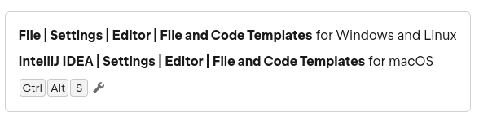
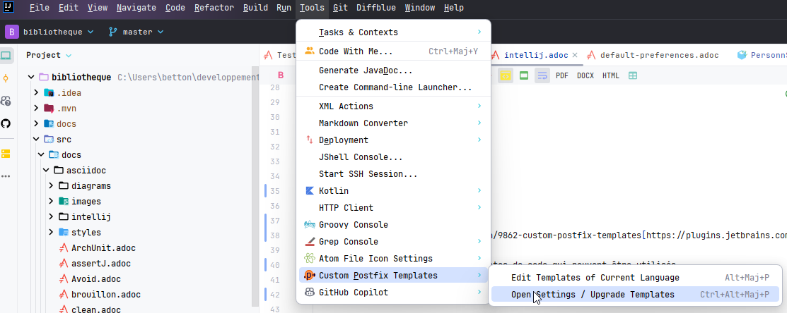
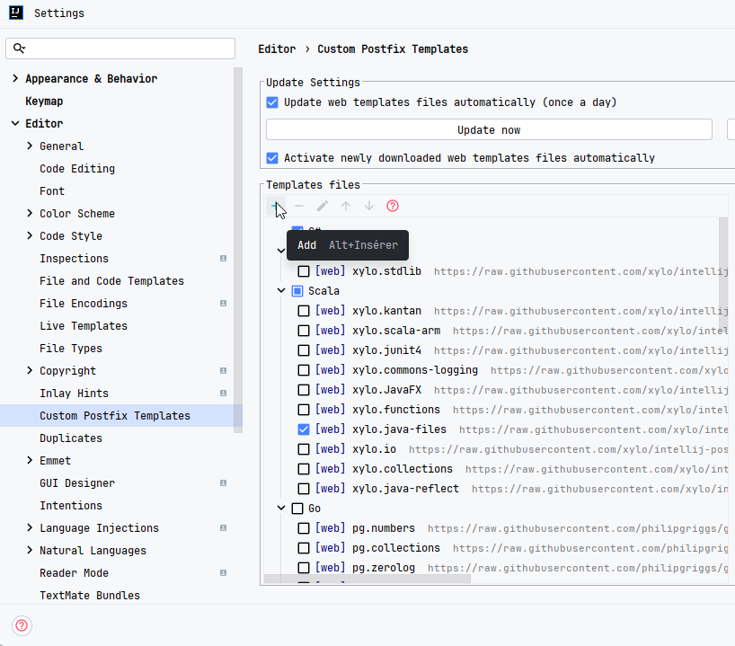
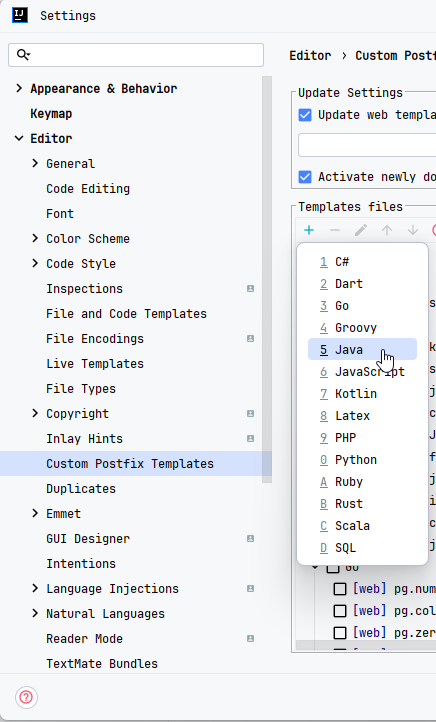
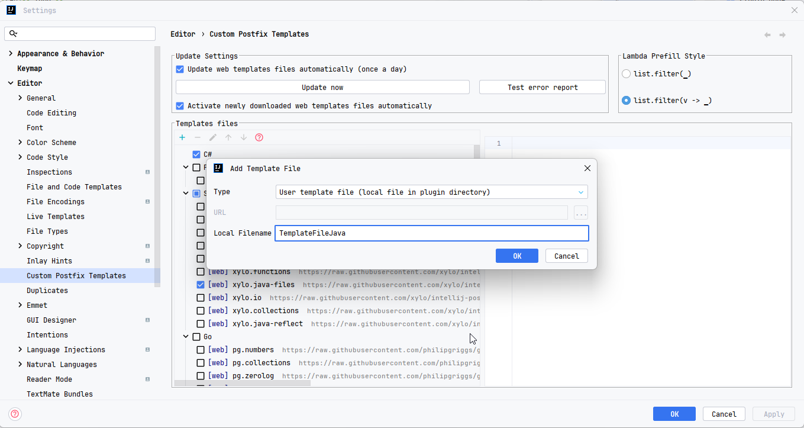

:doctype: book
:encoding: utf-8
:lang: fr
:icons: font
:tip-caption: pass:[&#x1F441;]
:warning-caption: pass:[&#9888]
:important-caption: pass:[&#9763;]
:note-caption: pass:[&#33;]
:caution-caption: pass:[&#9761;]
:source-highlighter: rouge
:rouge-style: github
:includedir: _includes
:author: Stéphane BETTON
:email: stéphane.betton@ag2rlamondiale.fr
:toc: left
:toclevels: 6

== Intellij
=== File and Code Templates
==== Ressources
https://www.jetbrains.com/help/idea/using-file-and-code-templates.html[using-file-and-code-templates]

==== Access

==== répertoire
Les fichiers template peuvent-être copiés dans

|===
|Emplacement |Windows |Linux

|Installation
|%APPDATA%\JetBrains\<product><version>\fileTemplates
|~/.config/JetBrains/<product><version>/fileTemplates
|===

==== Templates
Les templates sont des fichiers de type `*.ft` ou `*.java` qui sont utilisés pour générer des fichiers ou du code.
https://www.jetbrains.com/help/idea/using-live-templates.html[using live templates]

[NOTE]
Un document est disponible dans ce répertoire : liveTemplates.adoc

=== Custom Postfix Templates
https://plugins.jetbrains.com/plugin/9862-custom-postfix-templates[https://plugins.jetbrains.com/]

Ce plugin permet de créer des templates de code qui peuvent être utilisés.

==== Documentation

https://github.com/xylo/intellij-postfix-templates#custom-postfix-templates-for-intellij-idea[Doc]

==== Créer un template

Le répertoire de stockage du template est le suivant

* windows : `C:\Users\{User}\AppData\Roaming\JetBrains\{Version IntelliJIdea}\plugins\intellij-postfix-templates_templates\templates\java\TemplateFileJava.postfixTemplates.xml`
* linux : `/home/{user-home}/.local/share/JetBrains/{Version IntelliJIdea}/intellij-postfix-templates_templates/templates/java/TemplateFileJava.postfixTemplates.xml`

[NOTE]
Un document est disponible dans ce répertoire : +
PluginCustomPostfixTemplates.adoc[]

